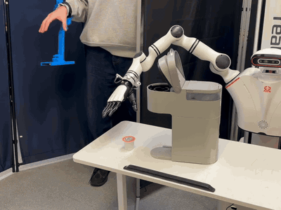
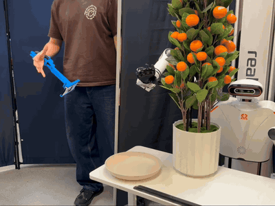
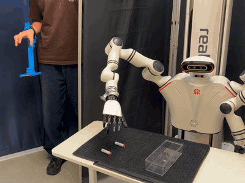
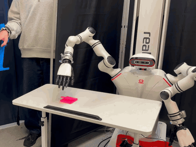
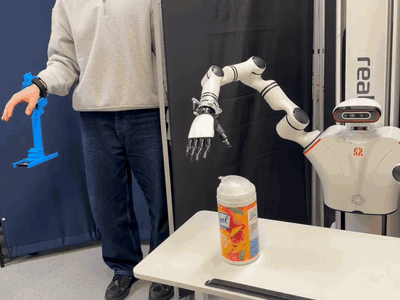
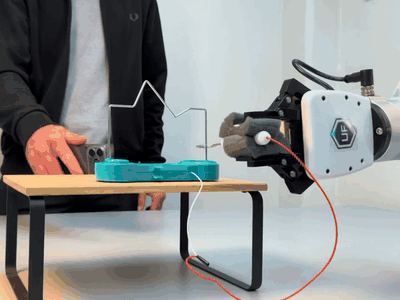

# &nbsp;&nbsp;Teledex

[](https://pypi.org/project/teledex/) [](https://pepy.tech/project/mujoco_ar) [](https://opensource.org/licenses/MIT) 

teledex lets you control robot frames using your iOS device's AR data.

<p align="center">
  
  
  
  
  
  
</p>

## Installation

You can install teledex package using pip:

```bash
pip install teledex
```

You can download the app from the [App Store](https://apps.apple.com/ae/app/mujoco-ar/id6612039501).

## Before You Get Started
You can use Teledex in phone-only mode (streams only the device pose) or with an optional 3D-printed holder to track finger motion while teleoperating. All printable parts are available in [`printables`](printables) folder.

See [**ASSEMBLY_GUIDE**](./printables/README.md) for assembly notes and [**SETUP_GUIDE**](GUIDE.md) to get started with your phone and robot setup.
 

## Basic Usage

### Basic Setup

```python
import teledex

session = teledex.Session()
session.start()

# Retrieve AR data
data = session.get_latest_data()
# Returns: {"position": (3,), "rotation": (3, 3), "button": bool, "button_secondary": bool, # "toggle": bool}
```

### MuJoCo Setup

Control MuJoCo frames (body, geom, or site) with Teledex:

```python
import teledex

session = teledex.Session()

mujoco_handler = teledex.MujocoHandler(model=my_model, data=my_data)
session.add_handler(mujoco_handler)

mujoco_handler.link_body(name="eef_target")

session.start()
```

## Additional Functions

```python
session.vibrate(sharpness=0.8, intensity=0.4, duration=0.01)
session.pause_updates()
session.resume_updates()
session.reset_position()
```

## Citation

If you use Teledex in your research, please cite:

```bibtex
@article{rayyan2026teledex,
  title={TeleDex: Accessible Dexterous Teleoperation},
  author={Rayyan, Omar and Gilles, Maximilian and Cui, Yuchen},
  journal={arXiv preprint arXiv:2603.17065},
  year={2026}
}
